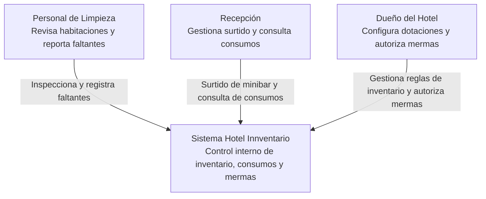

# 1. Diagrama de Contexto (Nivel 1)

```mermaid
graph TD
    Limpieza[Personal de Limpieza<br/>Revisa habitaciones y reporta faltantes]
    Recepcion[Recepción<br/>Gestiona surtido y consulta consumos]
    Dueno[Dueño del Hotel<br/>Configura dotaciones y autoriza mermas]

    Sistema[Sistema Hotel Innventario<br/>Control interno de inventario, consumos y mermas]

    Limpieza -->|Inspecciona y registra faltantes| Sistema
    Recepcion -->|Surtido de minibar y consulta de consumos| Sistema
    Dueno -->|Gestiona reglas de inventario y autoriza mermas| Sistema
```
