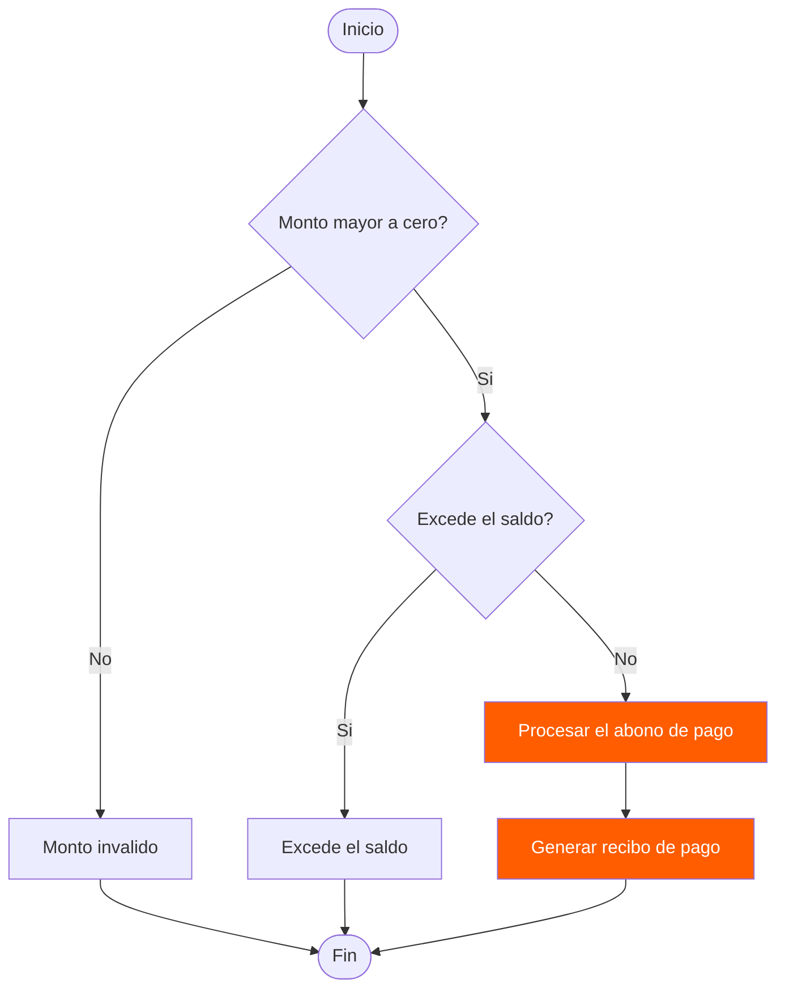

```mermaid
flowchart TD
ini([Inicio])
val{Monto mayor a cero?}
exc{Excede el saldo?}
apl[Procesar el abono de pago]
rec[Generar recibo de pago]
err1[Monto invalido]
err2[Excede el saldo]
fin([Fin])

ini --> val
val -->|No| err1
val -->|Si| exc
exc -->|Si| err2
exc -->|No| apl
apl --> rec
rec --> fin
err1 --> fin
err2 --> fin

style apl fill:#ff5d00,color:#fff
style rec fill:#ff5d00,color:#fff
```
